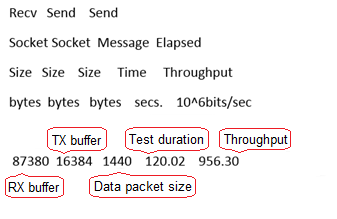

## Notes on Using G1 ECSs

-   G1 ECSs do not support specifications modification.
-   G1 ECSs support the following OSs:
    -   Windows Server 2008 R2 Enterprise SP1 64bit
    -   Windows Server 2012 R2 Standard 64bit

-   g1.2xlarge.8 G1 ECSs do not support the remote login function provided by the public cloud platform. To remotely log in to such an ECS, use MSTSC to log in to it and install VNC on the ECS.

    Non-g1.2xlarge.8 G1 ECSs support the remote login function provided by the public cloud platform. For details, see section  [Logging In to an ECS Using VNC](https://support.huaweicloud.com/en-us/usermanual-ecs/en-us_topic_0027290684.html).

-   If a G1 ECS is created using a private image, install a GPU driver on the ECS after the ECS creation. To download the driver, log in at  [http://www.nvidia.com/grid-eval](http://www.nvidia.com/grid-eval), set the NVIDIA GRID version to **4.1**, and select the **GRID for UVP**  software package. The operations are as follows:
    1.  Check whether NVIDIA is used for the first time:
        1.  If yes, go to step  [2](#li6493917120957).
        2.  If no, go to step  [4](#li31331234738).

    2.  Obtain the Product Activation Key \(PAK\) from the email indicating successful registration with NVIDIA.

        **Figure  1**  PAK  
        

    3.  Enter the PAK obtained in step  [2](#li6493917120957) on the **Redeem Product Activation Keys** page and click **Redeem**.

        **Figure  2**  Redeem Product Activation Keys  
        

    4.  Specify  **Username** and **Password** and click **LOGIN**.

        **Figure  3**  Logging in to the official NVIDIA website  
        

    5.  Log in at the official NVIDIA website as prompted and choose  **Software & Services** \> **Product Information**.

        

    6.  Click the  **Archived Versions**  tab.
    7.  Click  **NVIDIA GRID** of version **4.1**.
    8.  On the  **Product Download** page, click **GRID for UVP**.

-   If you log in to a G1 ECS using a RDP-based remote login tool, such as Windows MSTSC, GPU acceleration will fail. This is because MSTSC replaces the WDDM GPU driver with a non-accelerated remote desktop display driver. Therefore, you must use other methods to log in to the ECS, such as VNC.

    If the remote login function available on the management console fails to meet your service requirements, you must install a suitable remote login tool on the ECS.

